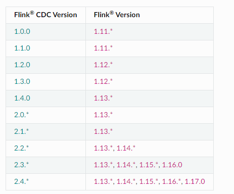

### JDBC connectors

https://nightlies.apache.org/flink/flink-docs-release-1.15/zh/docs/connectors/table/jdbc/

### upsert kafka


### Flink CDC 版本对应关系

https://ververica.github.io/flink-cdc-connectors/release-2.0/content/about.html#supported-flink-versions




### 常见问题

https://www.alibabacloud.com/help/zh/flink/support/faq-about-cdc#section-hpi-7wv-me9

- MySQL CDC读取全量数据后，不读增量数据是为什么？
```text
只读全量，不读增量。

MySQL CDC配置读取的是RDS MySQL 5.6备库或者只读实例时，可能出现这个问题。因为RDS MySQL 5.6该类型实例没有向日志文件里写入数据，导致下游同步工具无法读取增量的变更信息。

建议您使用可写实例或者升级RDS MySQL至更高版本。

MySQL全量数据读取完后一直卡住。

MySQL CDC全量阶段读取时间过长，导致最后一个分片数据量过大，出现OOM问题，作业Failover后卡住。

增加MySQL Source端的并发，加快全量读取的速度。

在MySQL CDC在做全量读到增量读的切换时，如果全量读是多并发，则在进入增量前要多等一个Checkpoint，来确保全量的数据已经写入到下游后再读取增量数据，从而保证数据的正确性。如果您设置的Checkpoint间隔时间比较大，例如20分钟，则会导致作业20分钟后才开始同步增量数据。

您需要根据业务情况设置合理的Checkpoint间隔时间。
```


### 维表Join

https://guosmilesmile.github.io/2020/08/21/Flink-SQL-join-%E7%BB%B4%E8%A1%A8/