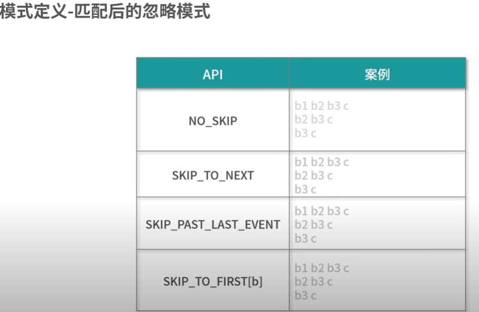

### complex event processing（复杂事件处理）

- CEP解决哪些问题
```text
1. 大量订单交易中发现那些虚假的交易
2. 在网站的访问日志中寻找那些使用脚本或者工具“爆破”登录的用户
3. 在快递运输中发现那些滞留很久没有签收的包裹
```
- 模式定义-简单模式

| 模式操作 | 描述 |
| --- | --- |
| where(condition) | 为当前模式定义一个条件。为了匹配这个模式，一个事件必须满足某些条件。 多个连续的where()语句取与组成判断条件： |
| or(condition) | 增加一个新的判断，和当前的判断取或。一个事件只要满足至少一个判断条件就匹配到模式： |
| until(condition) | 为循环模式指定一个停止条件。意思是满足了给定的条件的事件出现后，就不会再有事件被接受进入模式了。只适用于和oneOrMore()同时使用。NOTE: 在基于事件的条件中，它可用于清理对应模式的状态。 |
| subtype(subClass) | 为当前模式定义一个子类型条件。一个事件只有是这个子类型的时候才能匹配到模式： |
| oneOrMore() | 指定模式期望匹配到的事件至少出现一次。.默认（在子事件间）使用松散的内部连续性。 |
| timesOrMore(#times) | 指定模式期望匹配到的事件至少出现#times次。.默认（在子事件间）使用松散的内部连续性。 |
| times(#ofTimes) | 指定模式期望匹配到的事件正好出现的次数。默认（在子事件间）使用松散的内部连续性。  |
| times(#fromTimes, #toTimes) | 指定模式期望匹配到的事件出现次数在#fromTimes和#toTimes之间。默认（在子事件间）使用松散的内部连续性。 |
| optional() | 指定这个模式是可选的，也就是说，它可能根本不出现。这对所有之前提到的量词都适用。 |
| greedy() | 指定这个模式是贪心的，也就是说，它会重复尽可能多的次数。这只对量词适用，现在还不支持模式组。 |

- 模式定义-组合模式

1. next() 严格连续: 期望所有匹配的事件严格的一个接一个出现，中间没有任何不匹配的事件。
2. followedBy() 松散连续: 忽略匹配的事件之间的不匹配的事件。
3. followedByAny() 不确定的松散连续: 更进一步的松散连续，允许忽略掉一些匹配事件的附加匹配。
4. notNext() 不想后面直接连着一个特定事件
5. notFollowedBy() 

- 模式定义-匹配后的忽略模式
  <br/>


- Flink CEP的整个过程
```text
1. 从一个Source作为输入
2. 经过一个Pattern算子转换为PatternStream
3. 经过select/process算子转换为DataStream
```

- PatternStream
```java

```