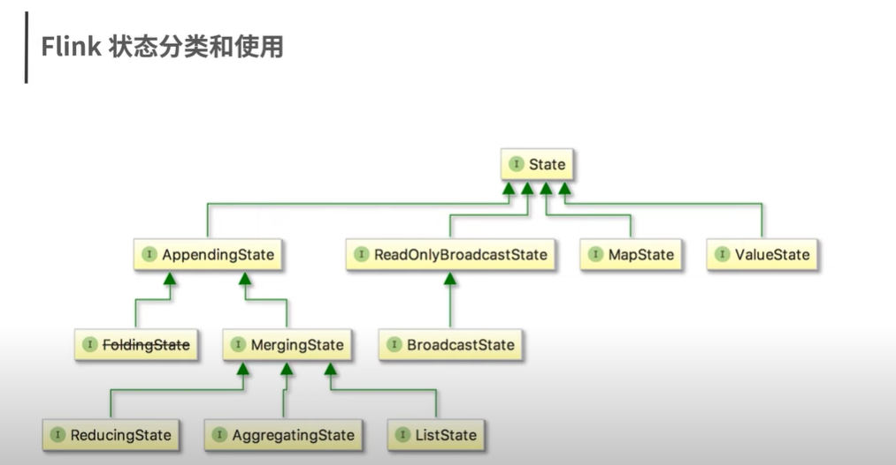

### flink state

- 概念
```text
状态：Flink程序的中间计算结果

存储支持：Task Manager JVM内存、HDFS、rocksdb、S3

状态划分：根据数据集是否按照某一个Key进行分区，分为两种情况 Keyed State、Operator State

状态隔离：每个算子子任务维护者这个算子子任务对应的状态存储，算子子任务之间的状态不能相互访问
```
- 状态分类
<br/>


- 状态访问
<br/>

- 状态过期
```text
如果一个状态设置了TTL，并且已经过期，那么我们之前保存的值就会被清理
```

- Operator State
```text
Operator State的应用场景不如Keyed State多，一般来说它会被用在Source或Sink等算子上
用来保存流入数据的偏移量或对输出数据做缓存
以保证Flink应用的Exactly-Once语义
```

- Flink 状态存储
```text
MemoryStateBackend：默认的，存储在TaskManager的堆内存中，一般用来本地调试
注意点：
1. 每个独立状态（state）默认限制大小为5MB，可以通过构造函数增加容量
2. 状态大小不能超过akka的FrameSize大小
3. 聚合后的状态必须能够放进JobManager的内存中

FsStateBackend：会把状态数据保存在TaskManager的内存中，适合用于大作业、状态较大、全局高可用的任务
CheckPoint时，将状态快照写入到配置的文件系统目录中，少量元数据信息存储到JobManager内存中

RocksDBStateBackend：
RocksDB数据库默认将数据存储在TaskManager的运行节点的数据目录下
这意味着，RocksDBStateBackend可以存储远超FsStateBackend的状态
可以避免向FsStateBackend那样一旦出现状态暴增会导致OOM
但是因为将状态数据保存到RocksDB数据库中，吞吐量有所下降

```