# FLink 部署模式

### Local模式

```shell
wget https://www.apache.org/dyn/closer.lua/flink/flink-1.18.0/flink-1.18.0-bin-scala_2.12.tgz

tar -zxvf flink-1.18.0-bin-scala_2.12.tgz

# 修改Dashboard绑定地址
vim conf/flink-conf.yaml

rest.port: 8081
rest.address: 0.0.0.0
# rest.bind-port: 8080-8090
rest.bind-address: 0.0.0.0

taskmanager.numberOfTaskSlots: 3

# 启动
./bin/start-cluster.sh

# 停止
./bin/stop-cluster.sh
```

### standalone 模式

- standalone是集群模式的一种，部署相对简单，可以支持小规模、少量的任务运行
- standalone模式相对缺少系统层面对集群中Job的管理，容易造成资源分配不均匀
- 资源隔离相对简单，任务之间资源竞争严重

| IP            | hostname | 备注   |
|---------------|----------|------|
| 192.168.1.100 | master   | 主节点  |
| 192.168.1.100 | slave1   | 从节点1 |
| 192.168.1.100 | slave2   | 从节点2 |

- 配置修改
<br/>
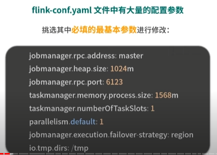
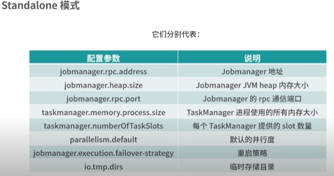
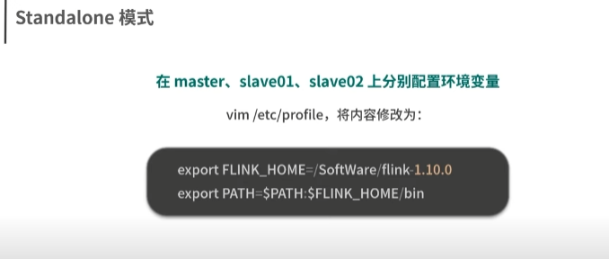

```shell
# 登录master节点
./bin/start-cluster.sh
```

### on yarn 模式

- Flink Yarn交互图
  <br/>
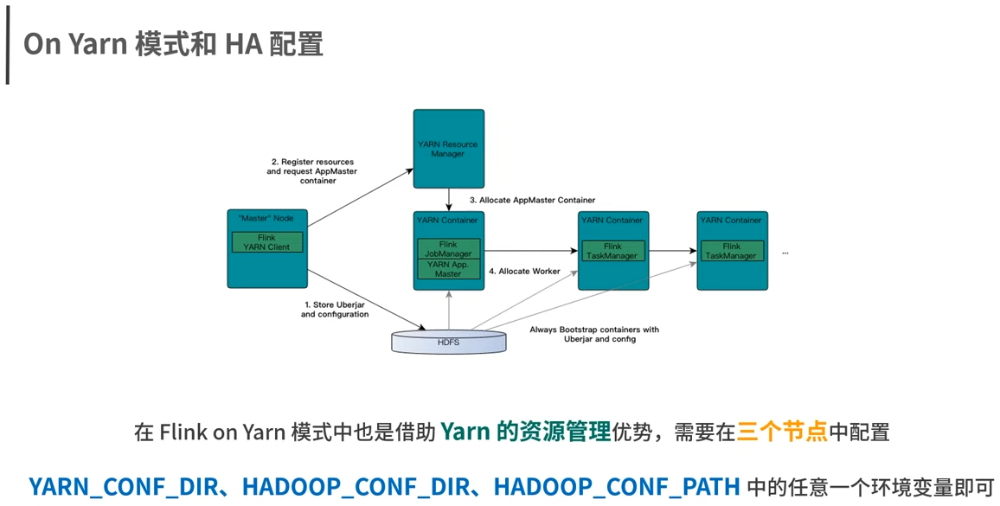

- On Yarn模式: Flink 1.10 与 Hadoop 2.6.5 兼容性最好
  <br/>
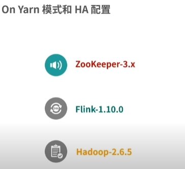

- 5台机器搭建集群
<br/>


- 集成hadoop添加环境变量
  <br/>
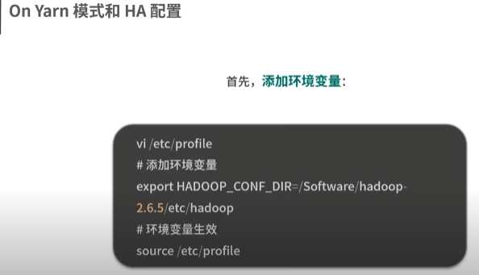

- 下载hadoop依赖包
  <br/>
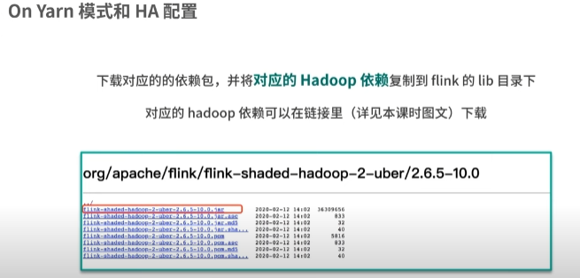

- 高可用配置
  <br/>
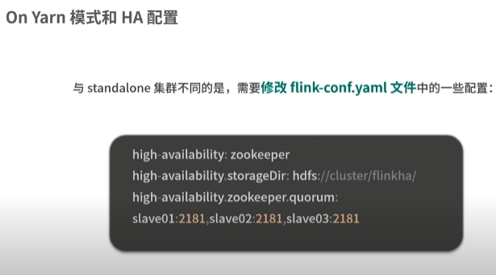
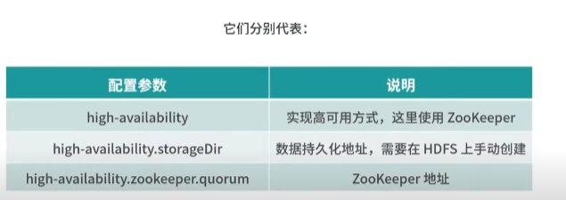

- 修改配置文件
  <br/>
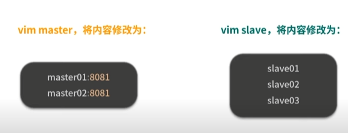
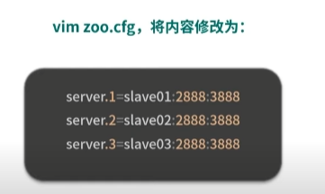

- 发送到从节点
  <br/>
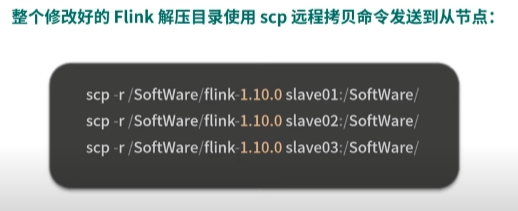

- 回到主节点 启动hadoop和zookeeper
  <br/>
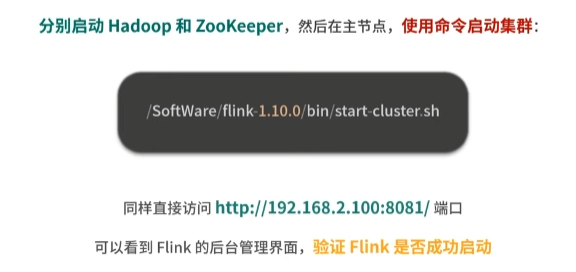

### On yarn 模式分类

- 直接在Yarn上运行任务(**推荐**)
  <br/>
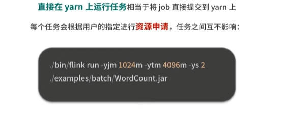
- Yarn Session模式(**不推荐**)
  <br/>
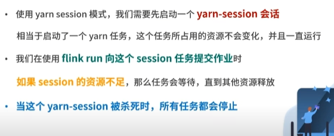

例如:<br/>

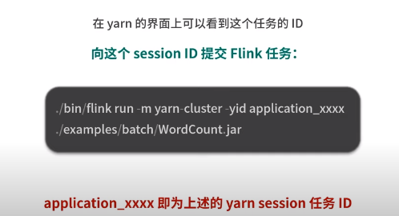
