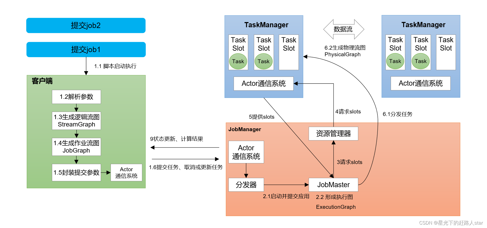
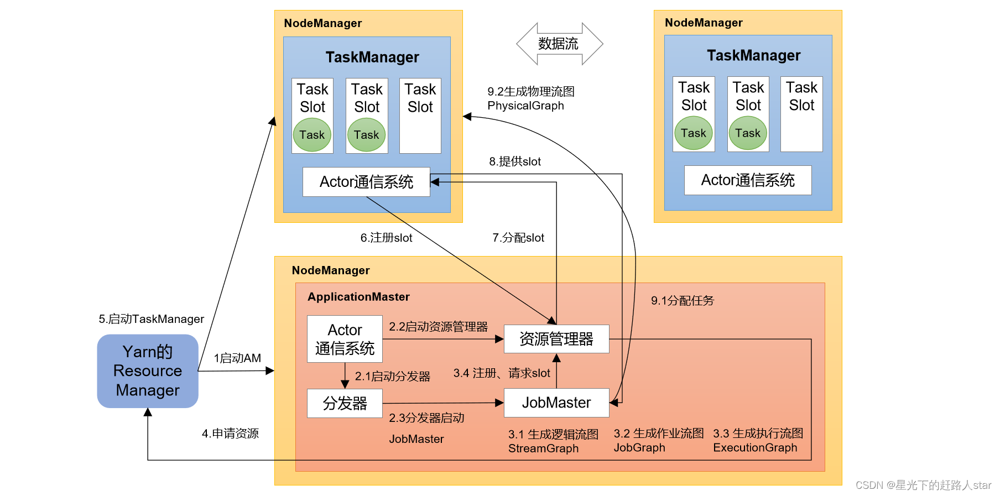

### Flink任务执行流程
1. 客户端（App）通过分发器提供的REST接口，将作业提交给JobManager
```text
org.apache.flink.runtime.dispatcher.StandaloneDispatcher      - Submitting job c1043f837f045783ff27ec91494c0929 (redisSetJob).
```
2. 分发器启动JobMaster，并将作业（包含JobGraph）提交给JobMaster
```text
14:24:30,439 INFO  org.apache.flink.runtime.jobmaster.JobMaster                  - Initializing job redisSetJob (c1043f837f045783ff27ec91494c0929).
```
3. JobMaster将JobGraph解析为可执行的ExecutionGraph
```text
14:24:30,502 INFO  org.apache.flink.runtime.jobmaster.JobMaster                  - Starting scheduling with scheduling strategy [org.apache.flink.runtime.scheduler.strategy.EagerSchedulingStrategy]
14:24:30,502 INFO  org.apache.flink.runtime.executiongraph.ExecutionGraph        - Job redisSetJob (c1043f837f045783ff27ec91494c0929) switched from state CREATED to RUNNING.
```
4. JobMaster得到所需的资源数量，让后向资源管理器请求资源（slots）
```text
14:24:30,526 INFO  org.apache.flink.runtime.jobmaster.JobMaster                  - JobManager successfully registered at ResourceManager, leader id: 912f85af86719c4346f2398e84b643db.
14:24:30,526 INFO  org.apache.flink.runtime.jobmaster.slotpool.SlotPoolImpl      - Requesting new slot [SlotRequestId{4a90743fdad6e82d076a68dd4a7cf311}] and profile ResourceProfile{UNKNOWN} from resource manager.
```
5. 资源管理器判断当前是否有足够的可用资源；如果没有，启动新的TaskManager
6. TaskManager启动之后，向ResourceManager注册自己可用任务槽（slots）
7. 资源管理器通知TaskManager为新的作业提供slots
```text
14:24:30,547 INFO  org.apache.flink.runtime.resourcemanager.StandaloneResourceManager  - Request slot with profile ResourceProfile{UNKNOWN} for job c1043f837f045783ff27ec91494c0929 with allocation id 38e8422f886d58aa5610021e9af8fdce.
14:24:30,547 INFO  org.apache.flink.runtime.taskexecutor.TaskExecutor            - Receive slot request 685cf97a80c76d373356e1314017322e for job c1043f837f045783ff27ec91494c0929 from resource manager with leader id 912f85af86719c4346f2398e84b643db.
```
8. TaskManager连接到对应的JobMaster，提供slots
9. JobMaster将需要执行的任务分发给TaskManager
```text
14:24:30,616 INFO  org.apache.flink.runtime.taskexecutor.TaskExecutor            - Received task Sink: Unnamed (2/2).
```
10. TaskManager执行任务

### Flink运行时架构

https://developer.aliyun.com/article/1345636

- Standalone会话模式
</br>


- Yarn应用模式作业提交流程
</br>


### Flink并行度设置
- 在代码中，可以在算子后面跟着调用setParallelism()方法，来设置当前算子的并行度
```text
stream.map(word -> Tuple2.of(word, 1L)).setParallelism(2);
```

- 也可以调用执行环境的setParallelism()方法，当前任务全局设置并行度
```text
env.setParallelism(2);
```

- 提交任务时设置 通过 -p参数
```shell
bin/flink run –p 2 –c com.zhm.wc.SocketStreamWordCount ./FlinkTutorial-1.0-SNAPSHOT.jar
```

- 配置文件中设置 flink-conf.yaml
```yaml
parallelism.default: 2
```