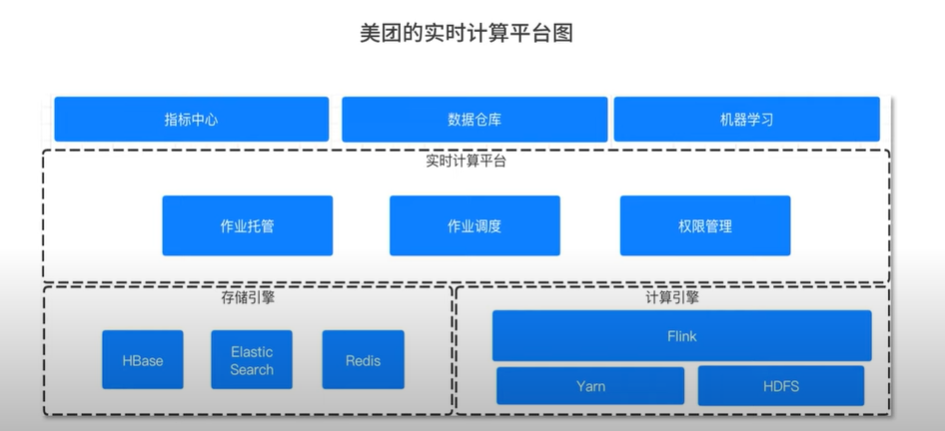
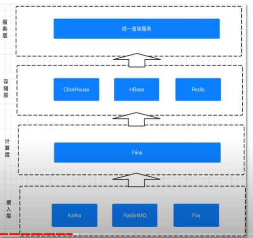
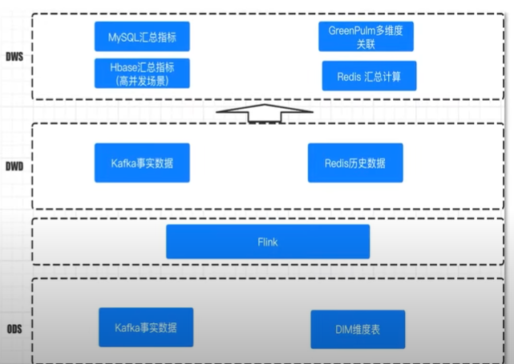
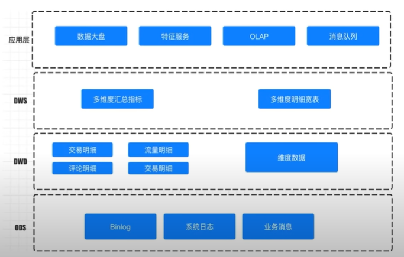

### Flink架构

- 主从模式
```text
Flink采用了经典的主从模式，DataFlow Graph 与 Storm 形成的拓扑 Topology结构类似

Flink程序启动后，会根据用户的代码处理成Stream Graph，然后优化成JobGraph
JobManager 会根据 JobGraph 生成 Execution Graph

Execution Graph才是Flink真正能执行的数据结构
当很多个Execution Graph分布在集群中，就会形成一张网状的拓扑结构
```

- 容错
```text
以前Spark Streaming任务，我们可以配置对应的checkpoint，也就是保存点
当任务出现failover时，会从checkpoint重新加载，使得数据不丢失，但这个过程会导致原来的数据重复处理，
不能做到“只处理一次”的语义

Flink基于两阶段提交实现了端到端的一次处理语义
```

- 反压
```text
Flink没有使用任何复杂的机制来解决反压问题，Flink在数据传输的过程中使用了分布式阻塞队列

在一个阻塞队列中，当队列满了以后发送者会被天然阻塞，这种阻塞功能相当于给Flink提供了反压能力
```

### 实时计算平台整体架构

- 收集层
```text
Kafka：高吞吐、低延迟特性，特别适合大数据量、高QPS业务场景

RocketMQ：在事务消息、一致性上有独特的优势
```

- 实时计算层
```text
Flink在计算层同时支持流式及批量分析应用，流批一体

Flink承担了数据的实时采集、实时计算和下游发送的角色
随着Blink的开源和一些其他实时产品的开源，支持可视化、SQL化的开发模式已经越来越普及
```

- 数据存储层
```text
Mysql、Redis、Hbase

OLAP的技术选型直接制约着数据存储层和数据服务层的能力
```

- 数据服务层
```text
数据服务层会提供统一的对外查询、多维度的实时汇总
加上完善的租户和权限设计，能够支持多部门、多业务的数据需求

基于数据的服务层还会有数据的展示、大屏、指标可视化等
```

### 实时计算架构案例

- 美团实时计算平台图
</br>


- 微博实时计算平台图
</br>


### Flink实时数仓

- 优势
```text
状态管理：实时数仓里面会进行很多的聚合计算，这些都需要对状态进行访问和管理，Flink支持强大的状态管理

丰富的API：Flink提供极为丰富的多层次API，包括 Stream API、Table API、Flink SQL

生态完善：实时数仓的用途广泛，Flink支持多种存储（HDFS、ES等）
```

- 实时数仓分层
```text
ODS源数据层
DWD明细层
ADM轻度汇总层
DWS汇总层
```

- 网易严选实时数据仓库设计图
</br>


- 美团实时数仓架构
</br>


### Flink输出数据方向

```text
高度汇总：高度汇总指标一般存储在Redis、HBase中供前端直接查询使用

明细数据：在一些场景下，我们运营人员需要查询明细数
有一些明细数据极为重要，比如双十一派送的包裹会有一些丢失和破损

实时消息：Flink在计算完成后，有一个下游是发往消息系统，给其它系统使用，
或者通过消息系统落库，将原来的落库拆成两步，方便我们进行问题的定位和排查。
```

### OLAP数据选型

```text
OLAP的选择是当前实施架构中最有争议和困难的

主流的OLAP引擎：Hive Hawq Presto Kylin Impala SparkSQL Druid Clickhouse Greeplum Doris
目前没有一个引擎能在数据量 灵活程度和性能上做到完美，用户需要根据自己的需求进行选型

ClickHouse：OLAP领域的HBase，单表查询性能优势巨大
Greenpulm：OLAP领域的PostgreSQL
```