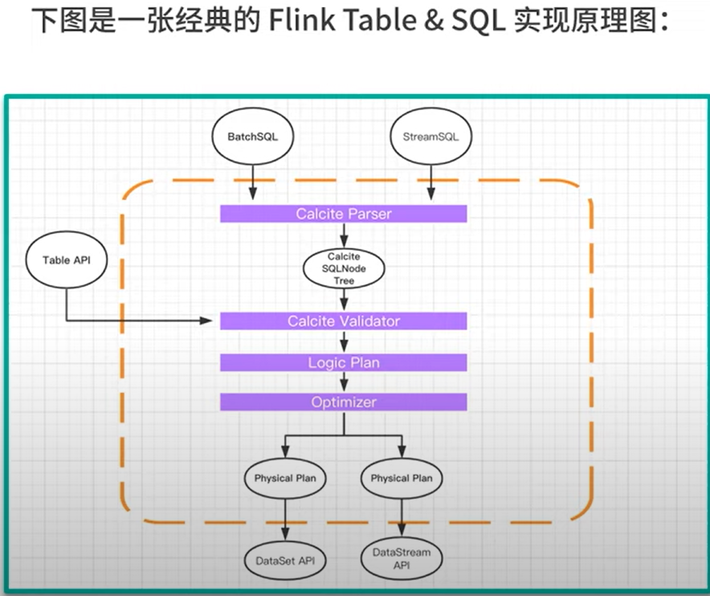
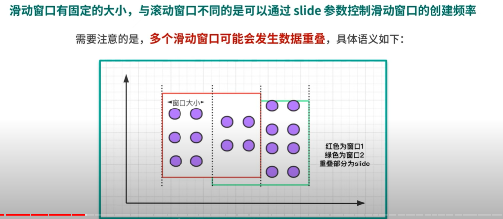
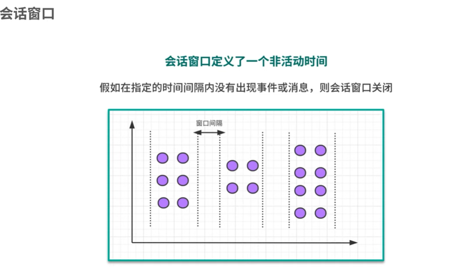
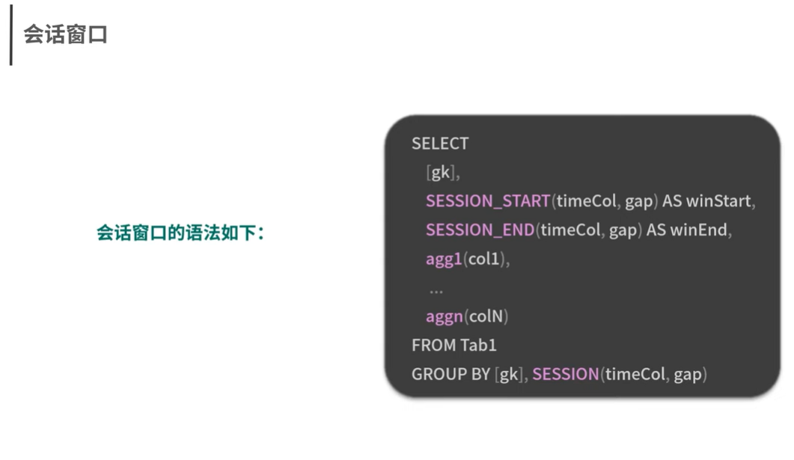
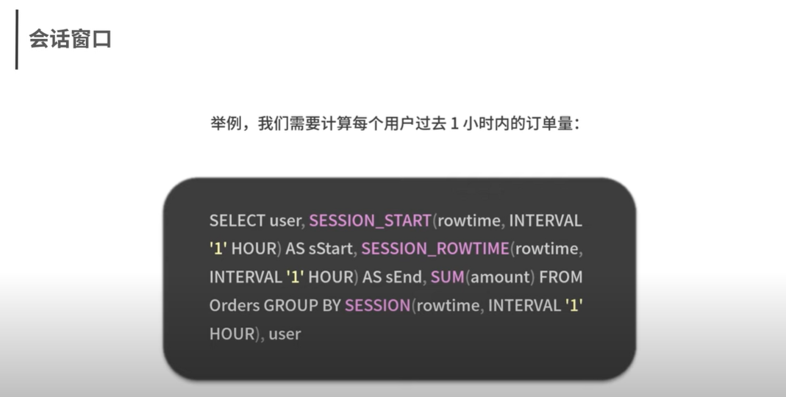
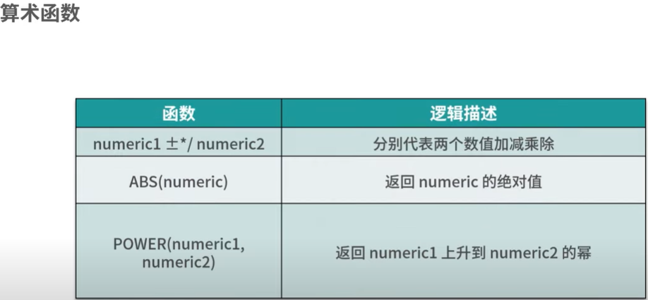
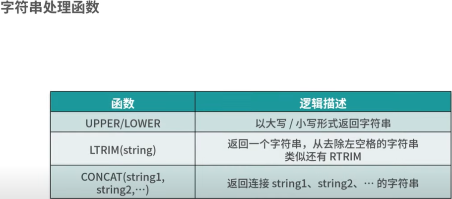
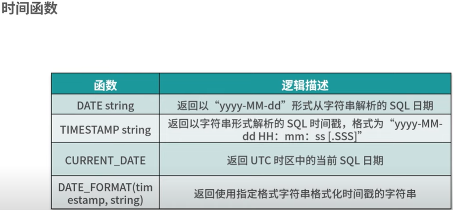

# FlinkTable FlinkSql

### 特性
- Flink在某种程度上实现了批流一体
- Flink底层对SQL的解析用到了Apache Calcite

### 原理

### Flink Table & SQL动态表

- 与传统的SQL查询相比，Flink Table & SQL 在处理数据时会时时刻刻处于动态的数据变化中，所以便有了动态表的概念
- 动态表的SQL会做连续查询，例如消费kafka消息，kafka消息会被源源不断的解析成一张增长的动态表，执行SQL，生成一张增长的结果表
- Flink从0.9开始支持 Table & SQL 功能，开发一直进行中，并没有支持所有场景下的计算逻辑
- 使用 Table & SQL API时要去官网查询当前版本Flink对Table&SQL的支持程度，尽量选择场景明确、逻辑不是特别复杂的场景

### 基本语法

- SELECT/AS/WHERE
- GROUP BY/DISTINCT/HAVING(聚合函数之后进行筛选)
- JOIN
- WINDOW滚动窗口：窗口有固定的大小，窗口中的数据不会叠加
 

- WINDOW滑动窗口：窗口有固定的大小，并且有生产间隔，可能会发生数据重叠
 

- WINDOW会话窗口：窗口没有固定的大小，根据用户传入的参数进行划分，窗口数据无叠加
 

### 内置函数
- 比较函数
 

- 逻辑函数

- 算数函数

- 字符串处理函数

- 时间函数
